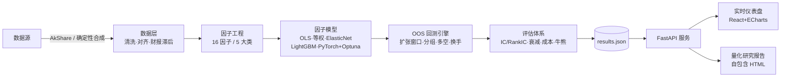

# 📊 FactorLab · A股多因子研究与样本外回测平台

> 一个工程化 + 量化双高标准的 A 股多因子研究平台：严谨的样本外验证、多模型对比（含 PyTorch 深度学习因子 + Optuna 超参搜索）、完整的因子评估体系，以及一键生成的研究报告与实时仪表盘。


---

## ✨ 项目亮点

- **严格样本外（OOS）纪律**：采用扩张窗口（expanding-window）训练，因子打分隔日换仓；**财报 T+90d 滞后**防止前视偏差（look-ahead bias），所有收益均为样本外真实表现。
- **多模型因子合成对比**：横截面的 OLS 回归、等权复合、ElasticNetCV，以及树模型 **LightGBM**（macOS 下自动回退 `HistGradientBoosting` 规避 OpenMP SIGSEGV），和 **PyTorch MLP 深度学习因子 + Optuna TPE 超参搜索**。
- **完整因子评估体系**：IC / RankIC / IR、五分组（quintile）多空组合、因子收益衰减（alpha decay）、交易成本敏感度（0–30bps）、牛 / 震荡 / 熊市分阶段稳健性。
- **工程化基建**：`uv` + `pydantic-settings` + `typer`(CLI) + FastAPI + React/ECharts。**前端为免构建 CDN SPA**，无需 `npm`/`vite` 即可部署；配套 Docker 多阶段镜像、GitHub Actions CI、MkDocs 文档。
- **一键量化研究报告**：`factorlab report` 生成**自包含 HTML**（内联数据 + ECharts），含 KPI 概览、模型净值、因子 IC 排行榜、衰减热力图、分组多空、成本稳健性、牛熊分析——双击即看。
- **一键实时仪表盘**：`factorlab serve` 启动 Web UI，含 KPI 英雄卡、因子排行榜、净值 / 热力图 / 分组 / 成本 / 稳健性多维可视化，并支持后台重算。
- **可复现 & 可切换数据源**：确定性合成数据保证结果跨进程一致；接入 AkShare 即用真实 A 股数据（懒加载，无需改动代码）。

---

## 🏗️ 系统架构



---

## 📚 因子库（16 因子 · 5 大类）

| 类别 | 因子 |
| --- | --- |
| 价值 Value | `ep`, `bp`, `sp` |
| 质量 Quality | `ep_chg_yoy`, `roe`, `roa`, `gp_a`, `accruals` |
| 动量 Momentum | `mom_1m`, `mom_3m`, `mom_12_10` |
| 波动 Volatility | `vol_20d`, `vol_60d`, `idio_vol` |
| 流动性 Liquidity | `turn_20d`, `amihud_20d` |

---

## 📈 样本外业绩快照

> 以下为默认配置（合成数据、持仓 20、调仓 21 日、双边成本 20bps、扩张窗口 6 折）下的**样本外**结果，仅供方法演示：

| 模型 | 年化收益 | 年化波动 | Sharpe | 最大回撤 | Calmar |
| --- | --- | --- | --- | --- | --- |
| 等权复合 `eq_weight` | 17.1% | 6.8% | **2.22** | -5.8% | 2.96 |
| ElasticNet `elastic_net` | 16.5% | 6.8% | 2.14 | **-4.7%** | **3.55** |
| LightGBM `lightgbm` | 14.6% | 6.8% | 1.86 | -5.0% | 2.94 |
| 深度学习 MLP `deep` | 14.9% | 6.9% | 1.87 | -5.5% | 2.69 |

*注：合成数据用于离线演示与 CI；接入真实 A 股数据后数值会有显著变化。因子合成模型的夏普均 > 1.8，说明因子在样本外仍具稳定选股能力。*

---

## 🚀 快速开始

```bash
# 0. 安装 uv（若未安装）
curl -LsSf https://astral.sh/uv/install.sh | sh

# 1. 同步依赖（生成可复现的虚拟环境）
uv sync

# 2. 运行端到端流水线：数据 → 因子 → 模型 → OOS 回测 → 评估
uv run factorlab run --models eq_weight,elastic_net,lightgbm,deep --hpo 8

# 3. 启动实时仪表盘（默认 http://localhost:8000）
uv run factorlab serve

# 4. 生成自包含量化研究报告（outputs/results/report.html）
uv run factorlab report
```

CLI 命令：`run` / `serve` / `report` / `config` / `version`。

---

## 🐳 部署

- **本地 / 服务器**：`uv run factorlab serve --port 8000`（前端由 FastAPI 直接托管，无需独立构建）。
- **容器化**：`docker compose up --build` 使用多阶段镜像（`node` 构建前端 + `python:3.11-slim` 运行 `uv run factorlab serve`）。
- **在线 Demo（可选）**：将 `outputs/results/report.html` 作为 `index.html` 推送到 `gh-pages` 分支并启用 GitHub Pages，即可获得免后端的在线研究报告。

---

## 🧱 技术栈

| 层 | 技术 |
| --- | --- |
| 语言 / 包管理 | Python 3.11 · `uv` |
| 配置 / CLI | `pydantic-settings` · `typer` + `rich` |
| 数据处理 | `polars` · `pandas` · `duckdb` · `pyarrow` |
| 量化 / 建模 | `statsmodels` · `scikit-learn` · `lightgbm` · **`torch`** · **`optuna`** |
| 服务 / 前端 | `FastAPI` · `uvicorn` · React 18 + ECharts 5（CDN 免构建 SPA） |
| 交付 / 文档 | Docker · GitHub Actions · MkDocs Material |

---

## 📁 项目结构

```
factorlab/            # 核心 Python 包
  data/               # 数据加载（AkShare 懒加载）+ 确定性合成 + 清洗
  factors/            # 5 大类 16 因子工程
  models/             # OLS/等权/ElasticNet/LightGBM/PyTorch 深度学习
  backtest/           # OOS 扩张窗口引擎、分组、成本模型
  evaluation/         # IC/RankIC、衰减、稳健性、换手
  api/                # FastAPI 服务（托管前端 + 报告）
  report.py           # 自包含 HTML 研究报告生成器
  pipeline.py         # 端到端编排
  cli.py              # typer 命令行入口
frontend/static-build/# 免构建 CDN SPA（index.html + app.js）
config/config.yaml    # 类型化配置
docs/                 # MkDocs 文档（方法论 / 数据字典 / 快速开始）
Dockerfile / docker-compose.yml / mkdocs.yml
```

---

## ⚠️ 免责声明

本项目仅用于**量化研究与教学演示**，所有回测结果基于历史数据，不构成任何投资建议。实盘需自行评估风险、合规与交易成本。合成数据为确定性演示数据，真实表现请以接入 AkShare 后的结果为准。
