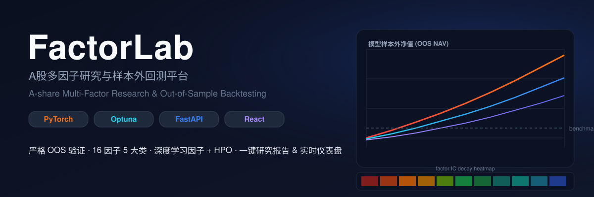
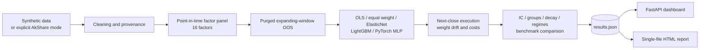

<p align="center">
  
</p>

<p align="center">
  <a href="https://github.com/dev-belly/ashare-multifactor-research/actions/workflows/ci.yml"></a>
  
  
  
</p>

<h1 align="center">FactorLab · A-share Multi-Factor Research</h1>

<p align="center">
  A reproducible pipeline for point-in-time factors, purged expanding-window evaluation, portfolio backtesting, and browser reports.
</p>

<p align="center">
  <a href="README.zh-CN.md">中文文档</a> ·
  <a href="https://dev-belly.github.io/ashare-multifactor-research/">Live report</a> ·
  <a href="#quick-start">Quick start</a>
</p>

## Project status

The default configuration uses deterministic synthetic data. It tests the research workflow; it does not demonstrate investable alpha.

AkShare support is deliberately strict. Calendar, universe, quote and industry coverage, and the actual data source are recorded in `results.json`. Point-in-time financial statement normalization is incomplete, so a strict AkShare run currently fails instead of presenting partial data as a full real-market backtest. Quote-only partial mode and synthetic fallback must be enabled explicitly and are labelled in output metadata.

## Implemented and tested

- 16 factors across value, quality, momentum, volatility, and liquidity families.
- Point-in-time alignment of financial values and disclosed share counts.
- Per-symbol next-day returns and 21-trading-day labels without cross-symbol shifts.
- Purging of the final 21 training dates before each OOS fold.
- Execution at the next trading day's close, with returns accruing only afterward, and natural holding-weight drift.
- Costs charged on actual traded weight using a single-side bps rate.
- A frictionless daily equal-weight universe benchmark beside strategy results.
- Standards-compliant JSON and tested report rendering.
- Read-only public dashboard; remote run endpoints require a server-side token.
- CI for Python tests and lint, docs, frontend build, and a synthetic smoke run.

## Architecture



## Factor zoo

| Family | Factors |
| --- | --- |
| Value | `ep`, `bp`, `sp`, `ep_chg_yoy` |
| Quality | `roe`, `roa`, `gp_a`, `accruals` |
| Momentum | `mom_1m`, `mom_3m`, `mom_12_10` |
| Volatility | `vol_20d`, `vol_60d`, `idio_vol` |
| Liquidity | `turn_20d`, `amihud_20d` |

## Quick start

Requires Python 3.11+ and [uv](https://docs.astral.sh/uv/).

```bash
git clone https://github.com/dev-belly/ashare-multifactor-research.git
cd ashare-multifactor-research
uv sync

uv run factorlab run \
  --data-source synthetic \
  --models eq_weight,elastic_net,lightgbm,deep \
  --hpo 0

uv run factorlab report
uv run factorlab serve
```

The report embeds research data in one HTML file, while ECharts and web fonts load from a CDN. Fully offline use requires vendoring those assets.

### Experimental AkShare mode

```bash
uv sync --extra data-akshare
uv run factorlab run --data-source akshare --models eq_weight --hpo 0
```

The strict command is expected to fail while complete point-in-time financial normalization is unavailable. For an explicitly partial quote/technical-factor experiment:

```yaml
data:
  source: akshare
  allow_partial_real_data: true
  allow_fallback: false
  max_symbols: 50
```

Always inspect `meta.actual_data_source`, `meta.fallback_reason`, and `meta.data_load` before interpreting a partial or fallback run.

## Remote run security

The browser is read-only. `POST /api/run`, `GET /api/run/state`, and `POST /api/reload` stay disabled unless the server has a token:

```bash
export FACTORLAB_RUN_TOKEN='replace-with-a-long-random-secret'
uv run factorlab serve
```

Authorized clients send `X-FactorLab-Run-Token`. Never embed the token in frontend code.

## Verification

```bash
uv sync --frozen --group dev
uv run ruff check --select E4,E7,E9,F factorlab tests
uv run pytest -q
uv run mkdocs build --strict

cd frontend
npm ci --no-audit --no-fund
npm run build
```

Synthetic returns can look strong because the simulator contains market and stock drift. Treat the benchmark, IC diagnostics, data-source metadata, and execution assumptions as part of the result. A high synthetic Sharpe is not evidence of real-world alpha.

## Known limitations

- AkShare financial statements are not yet normalized into complete point-in-time fields.
- Historical membership and delisted securities are not reconstructed; real-data experiments can have survivorship bias.
- Limit-up/down, suspensions, open-price execution, slippage, taxes, and capacity are not fully modeled.
- The benchmark is a frictionless daily equal-weight universe, not an investable total-return index.
- Borrow availability and short-sale constraints are outside the current scope.
- This is research software, not a trading system.

## Repository layout

```text
factorlab/              Python package
  data/                 source loading, provenance, cleaning, synthetic data
  factors/              point-in-time factor engineering
  models/               linear, tree, and neural models
  backtest/             OOS splits, execution, costs
  evaluation/           IC, decay, turnover, regime statistics
  api/                  read API and token-protected run endpoints
  pipeline.py           end-to-end orchestration
  report.py             browser report generator
frontend/               React + TypeScript + Vite dashboard
config/config.yaml      default synthetic configuration
tests/                  regression and security tests
docs/                   MkDocs documentation
```

## Disclaimer

For research and education only. Synthetic and historical backtests do not predict future returns and are not investment advice.

## License

[MIT](LICENSE)
