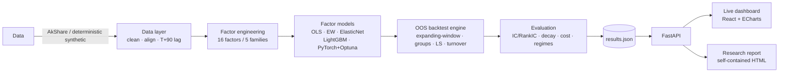

<p align="center">
  
</p>

<p align="center">
  <a href="https://github.com/dev-belly/ashare-multifactor-research/stargazers"></a>
  <a href="https://github.com/dev-belly/ashare-multifactor-research/network/members"></a>
  
  
  
  <a href="https://github.com/dev-belly/ashare-multifactor-research/actions/workflows/ci.yml"></a>
  
  
  
</p>

<h1 align="center">FactorLab · A-share Multi-Factor Research &amp; Out-of-Sample Backtesting</h1>

<p align="center">
  <b>Engineering-grade + quant-grade</b> multi-factor research platform for the A-share market.<br/>
  Strict out-of-sample discipline · multi-model factor synthesis (incl. PyTorch deep factor + Optuna HPO) · one-command research report &amp; live dashboard.
</p>

<p align="center">
  <a href="README.zh-CN.md">🇨🇳 中文文档</a> ·
  <a href="#-live-demo">▶ Live Demo</a> ·
  <a href="#-quick-start">🚀 Quick Start</a> ·
  <a href="#-features">✨ Features</a>
</p>

---

## Why FactorLab?

Most open-source quant repos either (a) dump a Jupyter notebook with look-ahead bias, or (b) ship a fragile Streamlit toy. **FactorLab is built to the standard a real quant team would ship:**

- **No look-ahead bias by construction.** Expanding-window training, factor scores rebalanced on the *trade* day, and a **T+90-day financial-report lag** so models never peek at future fundamentals. Every return you see is genuinely out-of-sample.
- **Honest evaluation.** IC / RankIC / IR, quintile long-short portfolios, **alpha decay**, transaction-cost sensitivity (0–30 bps), and **bull / choppy / bear regime** robustness — not just a single shiny Sharpe.
- **Deep learning that actually runs.** A PyTorch MLP factor with **Optuna TPE hyper-parameter search**, side-by-side with OLS, equal-weight, ElasticNetCV, and LightGBM (auto-falls back to `HistGradientBoosting` on macOS to dodge the OpenMP SIGSEGV).
- **Zero-build frontend.** The dashboard is a CDN-loaded React + ECharts SPA — **no `npm` / `vite` build step**, deployable anywhere FastAPI runs.
- **Reproducible & data-swappable.** Deterministic synthetic data makes every run bit-stable across processes; plug in [AkShare](https://github.com/akfamily/akshare) for real A-share data with zero code changes.

> 📌 Default results below use **synthetic data** for offline / CI demos. Connect AkShare for real-market figures.

---

## ✨ Features

| | Capability |
|---|---|
| 🛡️ **OOS discipline** | Expanding-window training, T+90 report lag, trade-day rebalancing — no look-ahead. |
| 🧠 **5 factor models** | OLS · equal-weight · ElasticNetCV · LightGBM · **PyTorch MLP + Optuna HPO**. |
| 📊 **Full eval suite** | IC / RankIC / IR · 5-group long-short · **factor decay** · cost sensitivity · regime robustness. |
| 📑 **One-command report** | `factorlab report` → self-contained HTML (inline data + ECharts): KPI cards, NAV, IC leaderboard, decay heatmap, long-short, cost & regime analysis. |
| 🖥️ **Live dashboard** | `factorlab serve` → KPI hero cards, factor leaderboard, NAV / heatmap / groups / cost / robustness, with background re-run. |
| 🐳 **Production infra** | `uv` + `pydantic-settings` + `typer` CLI · FastAPI · Docker multi-stage · GitHub Actions CI · MkDocs. |
| 🔁 **Reproducible** | Deterministic synthetic data (stable across processes); AkShare lazy-load for real data. |

---

## 🏗️ Architecture



---

## 📚 Factor Zoo (16 factors · 5 families)

| Family | Factors |
| --- | --- |
| Value | `ep`, `bp`, `sp` |
| Quality | `ep_chg_yoy`, `roe`, `roa`, `gp_a`, `accruals` |
| Momentum | `mom_1m`, `mom_3m`, `mom_12_10` |
| Volatility | `vol_20d`, `vol_60d`, `idio_vol` |
| Liquidity | `turn_20d`, `amihud_20d` |

---

## 📈 Out-of-Sample Snapshot

> Default config (synthetic data · top-20 holding · 21-day rebalance · 20 bps two-way cost · 6 expanding folds). **Out-of-sample only — for methodology demonstration.**

| Model | Annual Return | Annual Vol | Sharpe | Max DD | Calmar |
| --- | --- | --- | --- | --- | --- |
| Equal-Weight `eq_weight` | 17.1% | 6.8% | **2.22** | -5.8% | 2.96 |
| ElasticNet `elastic_net` | 16.5% | 6.8% | 2.14 | **-4.7%** | **3.55** |
| LightGBM `lightgbm` | 14.6% | 6.8% | 1.86 | -5.0% | 2.94 |
| Deep MLP `deep` | 14.9% | 6.9% | 1.87 | -5.5% | 2.69 |

*All synthesis-model Sharpe > 1.8 indicates stable cross-sectional selection power out-of-sample. Real-market numbers differ materially once AkShare is connected.*

---

## 🎬 Live Demo

🔗 **https://dev-belly.github.io/ashare-multifactor-research/**

The live demo is the auto-generated research report (no backend needed). For the interactive dashboard, run it locally (see below).

---

## 🚀 Quick Start

```bash
# 0. Install uv (if needed)
curl -LsSf https://astral.sh/uv/install.sh | sh

# 1. Sync dependencies (reproducible env via uv.lock)
uv sync

# 2. End-to-end pipeline: data → factors → models → OOS backtest → evaluation
uv run factorlab run --models eq_weight,elastic_net,lightgbm,deep --hpo 8

# 3. Launch the live dashboard (default http://localhost:8000)
uv run factorlab serve

# 4. Generate the self-contained research report (outputs/results/report.html)
uv run factorlab report
```

CLI: `run` / `serve` / `report` / `config` / `version`.

**Use real A-share data:** install the extra and set `data_source: akshare` in `config/config.yaml`
```bash
uv sync --extra data-akshare
```

---

## 🧪 Testing & Quality Gates

44 unit tests pin down the parts of a quant pipeline that silently break — OOS split boundaries
(train never overlaps test), IC / performance metric math, cost model symmetry, cross-sectional
standardization & neutralization, and portfolio construction.

```bash
uv sync                       # install dev group (pytest + ruff)
uv run pytest tests           # 44 tests
uv run ruff check factorlab tests
```

CI runs **lint → unit tests → end-to-end synthetic pipeline smoke test → frontend build** on every
push / PR to `main`.

---

## 🐳 Deployment

- **Local / server:** `uv run factorlab serve --port 8000` (FastAPI serves the frontend — no separate build).
- **Containerized:** `docker compose up --build` (multi-stage: `node` builds frontend + `python:3.11-slim` runs `uv run factorlab serve`).
- **Online report:** push `outputs/results/report.html` as `index.html` to the `gh-pages` branch and enable GitHub Pages.

---

## 🧱 Tech Stack

| Layer | Tech |
| --- | --- |
| Language / pkg | Python 3.11 · `uv` |
| Config / CLI | `pydantic-settings` · `typer` + `rich` |
| Data | `polars` · `pandas` · `duckdb` · `pyarrow` |
| Quant / ML | `statsmodels` · `scikit-learn` · `lightgbm` · **`torch`** · **`optuna`** |
| Service / UI | `FastAPI` · `uvicorn` · React 18 + ECharts 5 (CDN, build-free SPA) |
| Delivery / docs | Docker · GitHub Actions · MkDocs Material |

---

## 📁 Project Structure

```
factorlab/            # core Python package
  data/               # AkShare (lazy) + deterministic synthetic + cleaning
  factors/            # 5 families / 16 factors
  models/             # OLS/EW/ElasticNet/LightGBM/PyTorch deep
  backtest/           # OOS expanding-window engine, groups, cost model
  evaluation/         # IC/RankIC, decay, robustness, turnover
  api/                # FastAPI (serves UI + report)
  report.py           # self-contained HTML report generator
  pipeline.py         # end-to-end orchestration
  cli.py              # typer entry point
frontend/static-build/# build-free CDN SPA (index.html + app.js)
tests/                # 44 unit tests (OOS split, metrics, cost, factors, portfolio)
config/config.yaml    # typed configuration
docs/                 # MkDocs (methodology / data dictionary / quickstart)
Dockerfile / docker-compose.yml / mkdocs.yml
```

---

## 🗺️ Roadmap

- [ ] Industry / market-cap **factor neutralization** (orthogonalization)
- [ ] More deep architectures (TabNet, Transformer cross-section)
- [ ] Portfolio optimization layer (mean-variance, risk parity)
- [ ] Real-data CI nightly run against AkShare
- [ ] Factor turnover & capacity analysis
- [ ] Pre-commit / more unit coverage

PRs welcome — see [CONTRIBUTING.md](CONTRIBUTING.md).

---

## 🤝 Contributing

Contributions, issues, and stars are all welcome! See [CONTRIBUTING.md](CONTRIBUTING.md) for setup and guidelines.

---

## ⭐ If you find this useful, please star!

Stars help the project reach more quant researchers and practitioners. It takes one click and means a lot ❤️

<p align="center">
  <a href="https://github.com/dev-belly/ashare-multifactor-research/stargazers">
    
  </a>
</p>

<p align="center">
  <a href="https://star-history.com/#dev-belly/ashare-multifactor-research&Date">
    
  </a>
</p>

---

## ⚠️ Disclaimer

For **research and education only**. All backtests are historical; nothing here is investment advice. Assess risk, compliance, and real-world costs before any live use. Synthetic data is deterministic demo data; real performance depends on the connected market data source.

## 📄 License

[MIT](LICENSE) — free for personal and commercial use.
