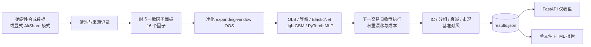

<p align="center">
  
</p>

<p align="center">
  <a href="https://github.com/dev-belly/ashare-multifactor-research/actions/workflows/ci.yml"></a>
  
  
  
</p>

<h1 align="center">FactorLab · A 股多因子研究平台</h1>

<p align="center">
  用于时点一致因子、净化扩张窗口验证、组合回测与浏览器报告的可复现研究流水线。
</p>

<p align="center">
  <a href="README.md">English</a> ·
  <a href="https://dev-belly.github.io/ashare-multifactor-research/">在线报告</a> ·
  <a href="#快速开始">快速开始</a>
</p>

## 项目状态

默认配置使用确定性合成数据，作用是验证研究流程，而不是证明策略存在可投资 Alpha。

AkShare 模式采取“宁可明确失败，也不伪装成功”的策略：交易日历、股票池、行情、行业覆盖率和实际数据源都会写入 `results.json`。由于完整时点财务报表标准化尚未完成，严格 AkShare 运行目前会报错；只有显式开启部分实数模式或合成数据降级时才会继续，并在 metadata 中标明。

## 已实现并有测试的关键逻辑

- 价值、质量、动量、波动率、流动性五类共 16 个因子。
- 财务字段与股本按实际可得日向后对齐，不用未来披露值重算历史市值。
- 下一日收益和 21 交易日前瞻标签按股票独立计算。
- 每个 OOS 折剔除训练集最后 21 个交易日，防止训练标签进入测试区间。
- 信号于下一交易日收盘执行，随后才承担收益；调仓间权重自然漂移。
- 成本按实际买卖权重和单边 bps 费率扣除。
- 报告展示无成本、每日等权的全股票池基准，避免把市场 Beta 写成 Alpha。
- 输出为标准 JSON，`NaN`/`Infinity` 会转成 `null`。
- 公共网页只读；后台运行接口要求服务端令牌。
- CI 覆盖 Python 单测与检查、文档、前端构建和合成流水线冒烟测试。

## 架构



## 因子库

| 类别 | 因子 |
| --- | --- |
| 价值 | `ep`, `bp`, `sp`, `ep_chg_yoy` |
| 质量 | `roe`, `roa`, `gp_a`, `accruals` |
| 动量 | `mom_1m`, `mom_3m`, `mom_12_10` |
| 波动率 | `vol_20d`, `vol_60d`, `idio_vol` |
| 流动性 | `turn_20d`, `amihud_20d` |

## 快速开始

需要 Python 3.11+ 和 [uv](https://docs.astral.sh/uv/)。

```bash
git clone https://github.com/dev-belly/ashare-multifactor-research.git
cd ashare-multifactor-research
uv sync

uv run factorlab run \
  --data-source synthetic \
  --models eq_weight,elastic_net,lightgbm,deep \
  --hpo 0

uv run factorlab report
uv run factorlab serve
```

报告把研究数据内联到一个 HTML 文件，但 ECharts 和网页字体仍由 CDN 加载；完全离线使用需要自行本地化这些资源。

### 实验性 AkShare 模式

```bash
uv sync --extra data-akshare
uv run factorlab run --data-source akshare --models eq_weight --hpo 0
```

完整时点财务字段尚未标准化，因此严格模式预期会明确失败。若只实验真实行情与技术因子，可显式设置：

```yaml
data:
  source: akshare
  allow_partial_real_data: true
  allow_fallback: false
  max_symbols: 50
```

使用部分实数或降级数据前，必须检查 `meta.actual_data_source`、`meta.fallback_reason` 和 `meta.data_load`。

## 远程运行安全

浏览器默认只读。`POST /api/run`、`GET /api/run/state` 和 `POST /api/reload` 只有配置服务端令牌后才开放：

```bash
export FACTORLAB_RUN_TOKEN='请替换成长随机密钥'
uv run factorlab serve
```

授权客户端需要发送 `X-FactorLab-Run-Token`，不要把令牌写进前端。

## 验证命令

```bash
uv sync --frozen --group dev
uv run ruff check --select E4,E7,E9,F factorlab tests
uv run pytest -q
uv run mkdocs build --strict

cd frontend
npm ci --no-audit --no-fund
npm run build
```

合成数据生成器含市场和个股漂移，因此回测可能很好看。应同时看无成本基准、IC、数据来源和交易假设；合成数据高 Sharpe 不等于真实 Alpha。

## 已知限制

- AkShare 财务报表还没有标准化成完整的时点字段。
- 未重建历史指数成分和退市股票，真实数据实验可能有生存偏差。
- 尚未完整模拟涨跌停、停牌无法成交、开盘成交、滑点、税费和容量。
- 内置基准是无成本、每日等权股票池，不是可投资指数全收益序列。
- 融券可得性和做空约束不在当前范围内。
- 这是研究软件，不是实盘交易系统。

## 项目结构

```text
factorlab/              Python 核心包
  data/                 数据源、来源记录、清洗、合成数据
  factors/              时点一致因子工程
  models/               线性、树模型与神经网络
  backtest/             OOS 切分、执行与成本
  evaluation/           IC、衰减、换手、市况统计
  api/                  只读 API 与令牌保护的运行接口
  pipeline.py           端到端编排
  report.py             浏览器报告生成器
frontend/               React + TypeScript + Vite 仪表盘
config/config.yaml      默认合成数据配置
tests/                  回归与安全测试
docs/                   MkDocs 文档
```

## 免责声明

仅用于研究与教学。合成数据和历史回测不能预测未来收益，不构成投资建议。

## 许可证

[MIT](LICENSE)
