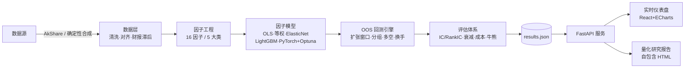

<p align="center">
  
</p>

<p align="center">
  <a href="https://github.com/dev-belly/ashare-multifactor-research/stargazers"></a>
  <a href="https://github.com/dev-belly/ashare-multifactor-research/network/members"></a>
  
  
  
  <a href="https://github.com/dev-belly/ashare-multifactor-research/actions/workflows/ci.yml"></a>
  
  
</p>

<h1 align="center">FactorLab · A股多因子研究与样本外回测平台</h1>

<p align="center">
  <b>工程化 + 量化双高标准</b> 的 A 股多因子研究平台。<br/>
  严格样本外验证 · 多模型因子合成（含 PyTorch 深度学习因子 + Optuna 超参搜索）· 一键研究报告 &amp; 实时仪表盘。
</p>

<p align="center">
  <a href="README.md">🇬🇧 English</a> ·
  <a href="#-在线-demo">▶ 在线 Demo</a> ·
  <a href="#-快速开始">🚀 快速开始</a> ·
  <a href="#-项目亮点">✨ 亮点</a>
</p>

---

## 为什么是 FactorLab？

多数开源量化项目要么是一堆带前视偏差的 Notebook，要么是个脆弱的 Streamlit 玩具。**FactorLab 按真实量化团队会交付的标准来构建：**

- **从架构上杜绝前视偏差。** 扩张窗口训练、因子打分隔日换仓、**财报 T+90 天滞后**，模型永远看不到未来基本面。你看到的每一笔收益都是货真价实的样本外。
- **诚实的评估。** IC / RankIC / IR、五分组多空、**因子衰减（alpha decay）**、交易成本敏感度（0–30bps）、**牛/震荡/熊** 分阶段稳健性——而不是只有一个好看的 Sharpe。
- **真能跑的深度学习。** PyTorch MLP 因子 + **Optuna TPE 超参搜索**，与 OLS、等权、ElasticNetCV、LightGBM 同台对比（macOS 下自动回退 `HistGradientBoosting` 规避 OpenMP SIGSEGV）。
- **零构建前端。** 仪表盘是 CDN 加载的 React + ECharts SPA——**无需 `npm`/`vite` 构建**，任何能跑 FastAPI 的地方都能部署。
- **可复现 & 可换数据源。** 确定性合成数据保证跨进程结果一致；接入 [AkShare](https://github.com/akfamily/akshare) 即用真实 A 股数据，零改代码。

> 📌 下方默认结果基于**合成数据**（用于离线/CI 演示）。接入 AkShare 后即为真实市场数据。

---

## ✨ 项目亮点

| | 能力 |
|---|---|
| 🛡️ **样本外纪律** | 扩张窗口训练、T+90 财报滞后、隔日换仓——无前视偏差。 |
| 🧠 **5 类因子模型** | OLS · 等权 · ElasticNetCV · LightGBM · **PyTorch MLP + Optuna HPO**。 |
| 📊 **完整评估体系** | IC / RankIC / IR · 五分组多空 · **因子衰减** · 成本敏感度 · 牛熊稳健性。 |
| 📑 **一键研究报告** | `factorlab report` → 自包含 HTML（内联数据 + ECharts）：KPI 卡、净值、IC 排行榜、衰减热力图、多空、成本与牛熊分析。 |
| 🖥️ **实时仪表盘** | `factorlab serve` → KPI 英雄卡、因子排行榜、净值/热力图/分组/成本/稳健性，支持后台重算。 |
| 🐳 **生产级基建** | `uv` + `pydantic-settings` + `typer` CLI · FastAPI · Docker 多阶段 · GitHub Actions CI · MkDocs。 |
| 🔁 **可复现** | 确定性合成数据（跨进程稳定）；AkShare 懒加载接真实数据。 |

---

## 🏗️ 系统架构



---

## 📚 因子库（16 因子 · 5 大类）

| 类别 | 因子 |
| --- | --- |
| 价值 Value | `ep`, `bp`, `sp` |
| 质量 Quality | `ep_chg_yoy`, `roe`, `roa`, `gp_a`, `accruals` |
| 动量 Momentum | `mom_1m`, `mom_3m`, `mom_12_10` |
| 波动 Volatility | `vol_20d`, `vol_60d`, `idio_vol` |
| 流动性 Liquidity | `turn_20d`, `amihud_20d` |

---

## 📈 样本外业绩快照

> 默认配置（合成数据、持仓 20、调仓 21 日、双边成本 20bps、扩张窗口 6 折）。**纯样本外，仅供方法演示。**

| 模型 | 年化收益 | 年化波动 | Sharpe | 最大回撤 | Calmar |
| --- | --- | --- | --- | --- | --- |
| 等权复合 `eq_weight` | 17.1% | 6.8% | **2.22** | -5.8% | 2.96 |
| ElasticNet `elastic_net` | 16.5% | 6.8% | 2.14 | **-4.7%** | **3.55** |
| LightGBM `lightgbm` | 14.6% | 6.8% | 1.86 | -5.0% | 2.94 |
| 深度学习 MLP `deep` | 14.9% | 6.9% | 1.87 | -5.5% | 2.69 |

*注：合成数据用于离线演示与 CI；接入真实 A 股数据后数值会有显著变化。因子合成模型夏普均 > 1.8，说明样本外仍具稳定选股能力。*

---

## 🎬 在线 Demo

🔗 **https://dev-belly.github.io/ashare-multifactor-research/**

在线 Demo 即自动生成的研究报告（免后端）。交互式仪表盘请本地运行（见下）。

---

## 🚀 快速开始

```bash
# 0. 安装 uv（若未安装）
curl -LsSf https://astral.sh/uv/install.sh | sh

# 1. 同步依赖（生成可复现的虚拟环境）
uv sync

# 2. 运行端到端流水线：数据 → 因子 → 模型 → OOS 回测 → 评估
uv run factorlab run --models eq_weight,elastic_net,lightgbm,deep --hpo 8

# 3. 启动实时仪表盘（默认 http://localhost:8000）
uv run factorlab serve

# 4. 生成自包含量化研究报告（outputs/results/report.html）
uv run factorlab report
```

CLI 命令：`run` / `serve` / `report` / `config` / `version`。

**接入真实 A 股数据：** 安装扩展并在 `config/config.yaml` 设 `data_source: akshare`
```bash
uv sync --extra data-akshare
```

---

## 🐳 部署

- **本地 / 服务器**：`uv run factorlab serve --port 8000`（前端由 FastAPI 直接托管，无需独立构建）。
- **容器化**：`docker compose up --build` 使用多阶段镜像（`node` 构建前端 + `python:3.11-slim` 运行 `uv run factorlab serve`）。
- **在线报告**：将 `outputs/results/report.html` 作为 `index.html` 推送到 `gh-pages` 分支并启用 GitHub Pages。

---

## 🧱 技术栈

| 层 | 技术 |
| --- | --- |
| 语言 / 包管理 | Python 3.11 · `uv` |
| 配置 / CLI | `pydantic-settings` · `typer` + `rich` |
| 数据处理 | `polars` · `pandas` · `duckdb` · `pyarrow` |
| 量化 / 建模 | `statsmodels` · `scikit-learn` · `lightgbm` · **`torch`** · **`optuna`** |
| 服务 / 前端 | `FastAPI` · `uvicorn` · React 18 + ECharts 5（CDN 免构建 SPA） |
| 交付 / 文档 | Docker · GitHub Actions · MkDocs Material |

---

## 📁 项目结构

```
factorlab/            # 核心 Python 包
  data/               # 数据加载（AkShare 懒加载）+ 确定性合成 + 清洗
  factors/            # 5 大类 16 因子工程
  models/             # OLS/等权/ElasticNet/LightGBM/PyTorch 深度学习
  backtest/           # OOS 扩张窗口引擎、分组、成本模型
  evaluation/         # IC/RankIC、衰减、稳健性、换手
  api/                # FastAPI 服务（托管前端 + 报告）
  report.py           # 自包含 HTML 研究报告生成器
  pipeline.py         # 端到端编排
  cli.py              # typer 命令行入口
frontend/static-build/# 免构建 CDN SPA（index.html + app.js）
config/config.yaml    # 类型化配置
docs/                 # MkDocs 文档（方法论 / 数据字典 / 快速开始）
Dockerfile / docker-compose.yml / mkdocs.yml
```

---

## 🗺️ 路线图

- [ ] 行业 / 市值 **因子中性化**（正交化）
- [ ] 更多深度学习架构（TabNet、Transformer 截面）
- [ ] 组合优化层（均值方差、风险平价）
- [ ] 基于 AkShare 的 CI 每日实盘数据夜跑
- [ ] 因子换手与容量分析
- [ ] 提升单测覆盖率

欢迎 PR —— 见 [CONTRIBUTING.md](CONTRIBUTING.md)。

---

## 🤝 贡献

欢迎提交 Issue、PR 与 Star！贡献指南见 [CONTRIBUTING.md](CONTRIBUTING.md)。

---

## ⭐ 如果对你有帮助，请点个 Star！

Star 能帮助项目被更多量化研究者与从业者看到。只需一键，意义重大 ❤️

<p align="center">
  <a href="https://github.com/dev-belly/ashare-multifactor-research/stargazers">
    
  </a>
</p>

<p align="center">
  <a href="https://star-history.com/#dev-belly/ashare-multifactor-research&Date">
    
  </a>
</p>

---

## ⚠️ 免责声明

本项目仅用于**量化研究与教学演示**，所有回测结果基于历史数据，不构成任何投资建议。实盘需自行评估风险、合规与交易成本。合成数据为确定性演示数据，真实表现请以接入 AkShare 后的结果为准。

## 📄 许可证

[MIT](LICENSE) —— 个人与商业使用均免费。
